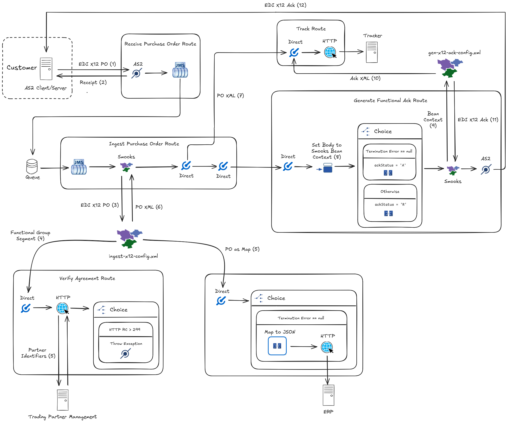

About
=====

As depicted below, this example illustrates a common supply chain transaction flow where (1) a customer transmits an EDI purchase order to a supplier requesting goods or services followed by (2) the supplier acknowledging the transaction. Between receiving the purchase order and acknowledging it, the supplier exchanges bits and pieces of the order with its internal systems.



The [Camel application](https://camel.apache.org/) (i.e., `camel/edi-x12-as2.camel.yaml`) represents the supplier and the downstream systems are mocked with the help of Camel routes (i.e., `camel/fake.camel.yaml`). The example integrates a flavour of EDI called [X12](https://x12.org) over [AS2](https://camel.apache.org/components/next/as2-component.html). From the Camel application, the [Smooks component](https://camel.apache.org/components/next/smooks-component.html) is leveraged to parse the EDI purchase order and generate the EDI acknowledgement. Smooks breaks down the EDI purchase order into fragments so that individual EDI segments can be transformed and routed accordingly.

## How to run?

1. [Install Camel JBang](https://camel.apache.org/manual/camel-jbang.html#_installation)
2. Run the Camel integration from the terminal with:
    ```shell
    cd camel && camel run * --camel-version=4.10.0
    ```
3. From another terminal window, send an X12 850 purchase order to the AS2 Camel endpoint, or better yet, dispatch the message from Camel JBang as shown next:
    ```shell
    camel cmd send --body="$(cat test/payload.edi)" --endpoint="as2:client/send?inBody=ediMessage&targetHostName=localhost&targetPortNumber=8081&ediMessageContentType=application/edi-x12;charset=US-ASCII&as2From=acme&as2To=mycorp&from=alice@example.org&requestUri=/mycorp/orders&subject=Purchase Order&as2MessageStructure=PLAIN"
    ```

    The above command will send an AS2 message where the body is read from the local file named `payload.edi`. The message is sent to the running Camel integration that will process the AS2 message. The Camel integration will then consume the payload and print to the console:
    
    ```shell
    Received functional ack:
    ISA*00*          *00*          *ZZ*MYCORP         *ZZ*ACME           *250108*0821*U*00204*000000264*1*T*>~
    GS*FA*MYCORP*ACME*20250108*082104*000000001*X*004010~
    ST*997*0001~
    AK1*850*000000001~
    AK9*A~
    SE*4*0001~
    GE*1*000000001~
    IEA*1*000000264~
    ```