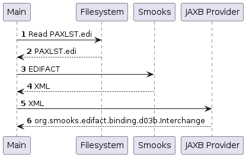

About
=====

Illustrates a way for binding EDIFACT to POJOs, without mapping. This project reads an EDIFACT document from the filesystem and feeds it to Smooks to obtain the EDIFACT's XML representation. The returned XML is then bound to a `org.smooks.edifact.binding.d03b.Interchange` POJO with [JAXB](https://javaee.github.io/jaxb-v2/). 

To map EDIFACT to POJOs, instead of just binding, the [JavaBean cartridge](https://www.smooks.org/documentation/#javabeans) is recommended instead of JAXB. Visit the [edi-to-java project](../edi-to-java/README.md) to view an example that maps as well as binds the EDI. Note that Smooks in `edi-to-java` is configured to read plain EDI but the configuration can be easily modified to use `edifact:parser` instead of `edi:parser`.

### How to run?

1. `mvn clean package`
2. `mvn exec:exec`

### UML Sequence Diagram

